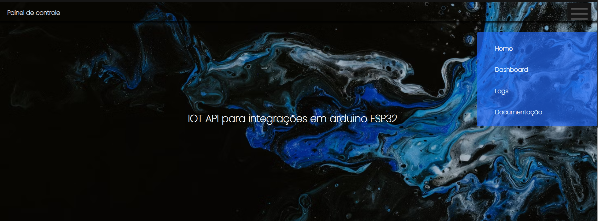
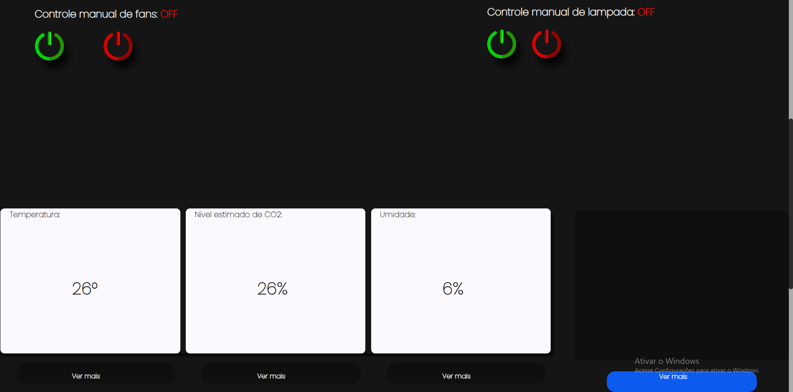
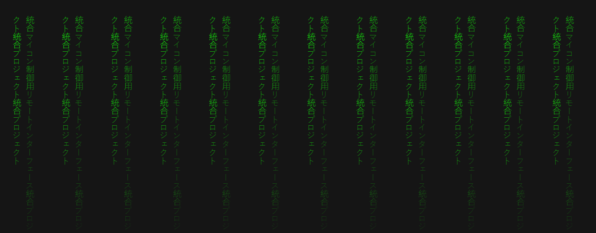
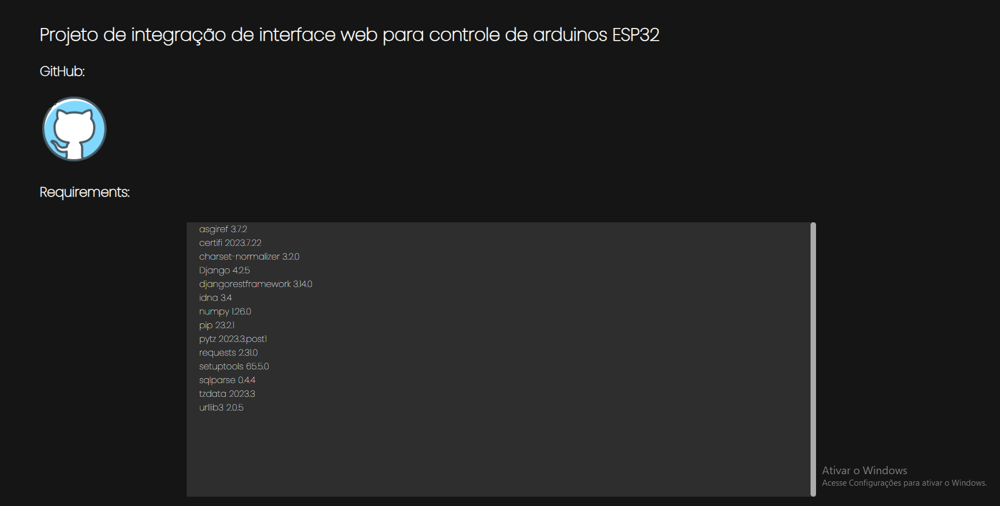
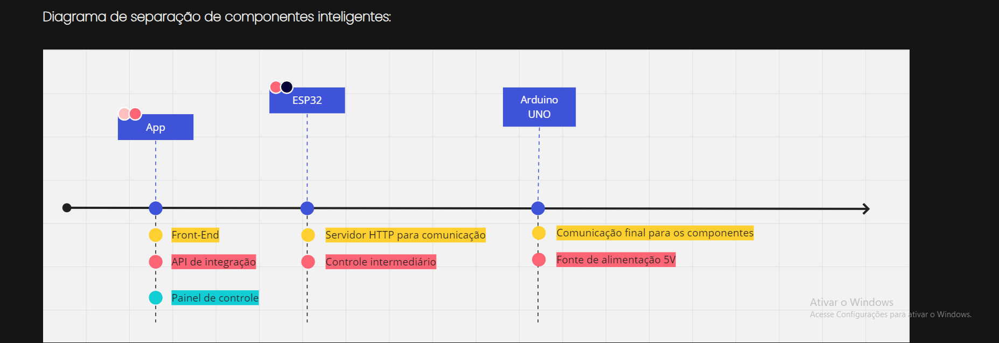
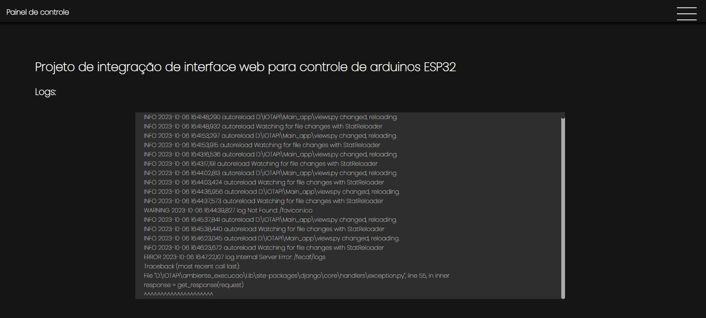

# Projeto de integração de interface web para controle de arduinos ESP32

## Contextualização:

O seguinte projeto tem como objetivo a criação de um app de integração para arduino ESP32, a comunicação deste dispositivo é realizada via wifi, e a fim de controlar e monitorar as informações do projeto final, foi criado um app capaz de realizar requisições para o micro controlador.

## O projeto:

O projeto consiste em uma estufa, para cultivo de plantas no geral, especialmente hortaliças, os processos deste projeto devem ser controlados de maneira automática, desde os parâmetros do ambiente até processos como a irrigação.

Atualmente o projeto conta com a estruturação física e modelagem eletrônica do mesmo, bem como os scripts dos microcontroladores estão disponíveis para validação através do repositório: https://github.com/MAIA332/Smart-greenhouse

# Utilização

1. Clone o repositório:

```git clone git@github.com:MAIA332/IOTAPI.git```

2. Instale as dependências:

```pip install requirements.txt```

3. Execute o arquivo principal:

```python manage.py runserver 0.0.0.0:8000```

# Configurações:

Será necessário alterar as seguintes configurações a baixo de acordo com as especificações da utilização:

Em *Main_app* > *views.py*, alterar o IP do modulo de comunicação (ESP32)

```
27 Integrations = app_config.Integrations('http://10.0.50.137')
```

# Interface:

## Home page:



## Painel de controle (BETA)




## Rodapé:



## Pagina de documentação:




## Pagina de logs:




